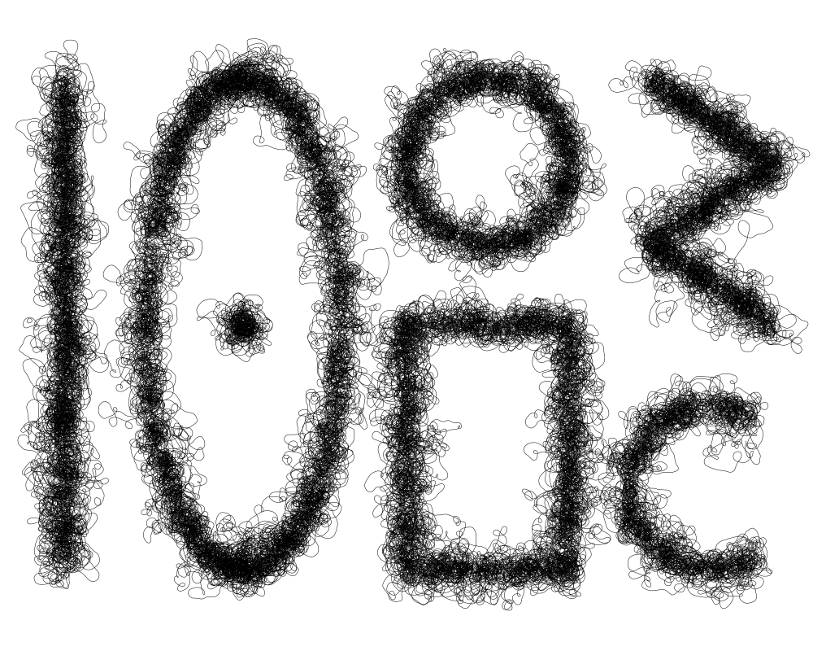

# scribble

Scribble is an add on library for [bitlib](http://github.com/bit101/bitlib) to to create paths that look as if they were scribbled. Designed to work with [blcairo](http://github.com/bit101/blcairo).

Many parameters are available to alter the look and feel of the scribble, from small tight loops to widely meandering random lines.

A selection of shape drawing functions also exist, such as lines, circles, ellipses, rectangles, dots, paths, arcs. More to come.
